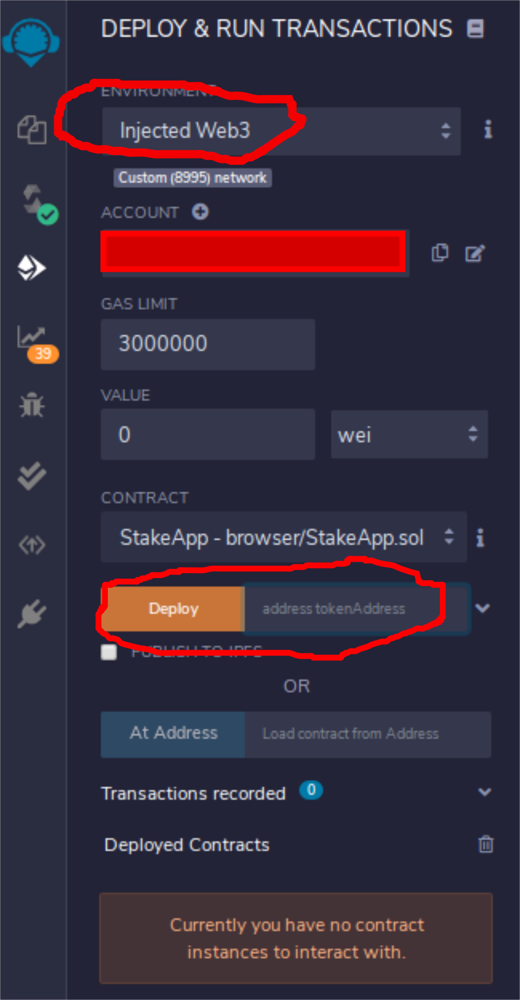
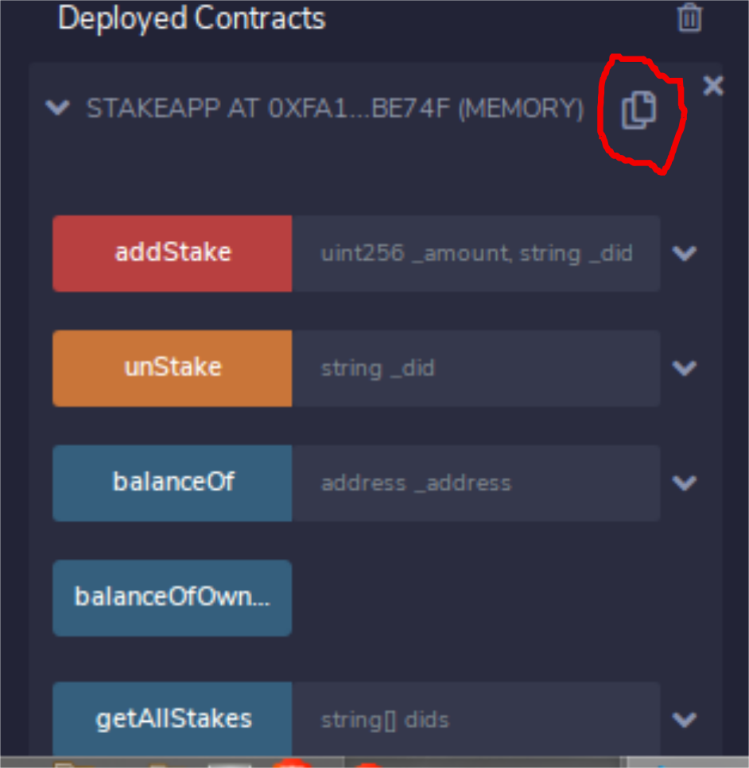

# Staking token contract

## To do:

1. Add deployment scripts in `truffle migrations` to avoid manual deployment steps.

2. Add reward logic in stakes.

## Deployment

### Prequisites

    a. Metamask installed.
    b. Conntect to the network where contract is to be deployed.
    c. Address of ERC20 token contract to be used for staking.

### Steps

1. Clone this repository.
2. Deploy using [Remix IDE](https://remix.ethereum.org/):

   a. Copy the [StakeToken](https://github.com/akshay-ap/StakeToken/blob/master/contracts/StakeApp.sol) contract code in Remix IDE.

   Note: Please change the import state [Link](https://github.com/akshay-ap/StakeToken/blob/bff01fd30a7cb1f4d161d50d9a5f68d900182780/contracts/StakeApp.sol#L5) in Remix IDE to _https://github.com/OpenZeppelin/openzeppelin-contracts/blob/master/contracts/token/ERC20/ERC20.sol_.

3. Select the Solidity compiler version 6.0.2 (recommended) or above.

4. Compile the contract in Remix IDE.

5. Select the `Environment` as `Injected Web3`.

6. Enter the `ERC20 token` contract address Deploy the contract.

   e.g. Ocean Token contract address for Nile (Ocean Protocol) is _0x9861Da395d7da984D5E8C712c2EDE44b41F777Ad_

   

7. Click deploy.

8. Copy the StakeApp contract address.

   

### Local Setup

#### Solidity contract build and deployment

1. Clone the repository
2. Install gananche (Local ethereum network development)
3. Link the project using `truffle-config.js` file in ganache.

4. Install dependencies:

   `npm i`

   `sudo npm i -g truffle`

5. Complie the contract(s):

   `truffle compile`

6. Deploy the contract on local ethereum network:

   `truffle migrate`

#### Webapp setup

1. Clone the repository
2. Change directory

   `cd app`

3. Install dependencies

   `npm i`

4. Run local development instance

   `npm run serve`

5) Open browser with metamask installed and connect to local ethereum network.

6) Open link: http://localhost:8080
